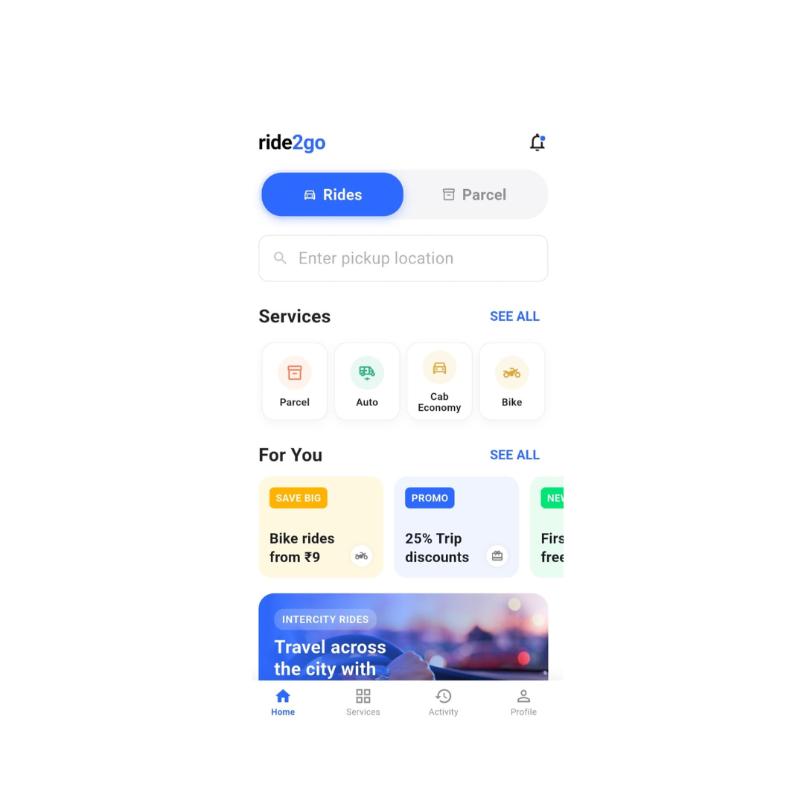
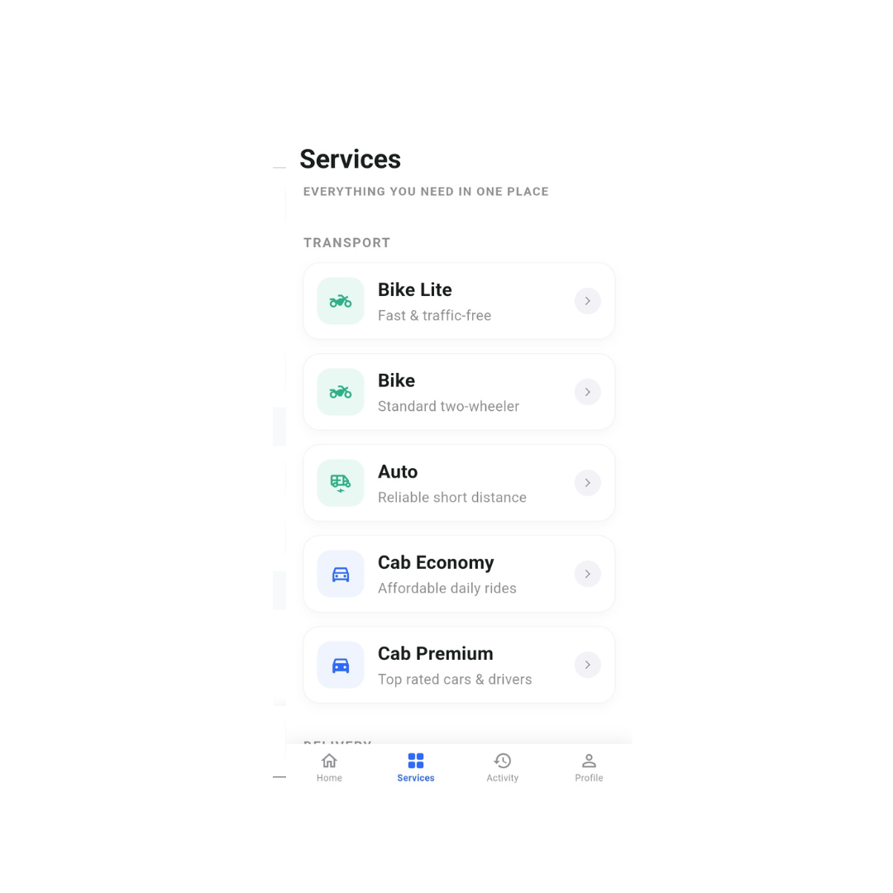
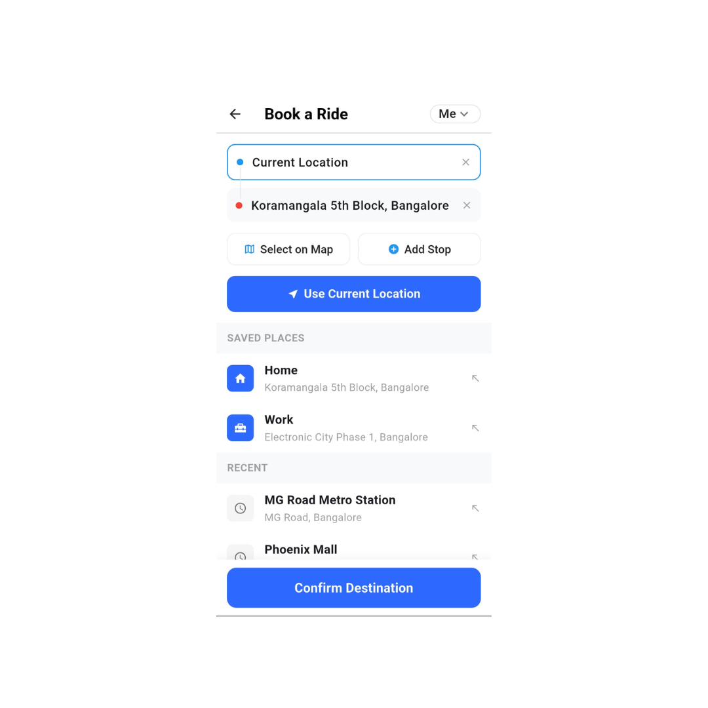
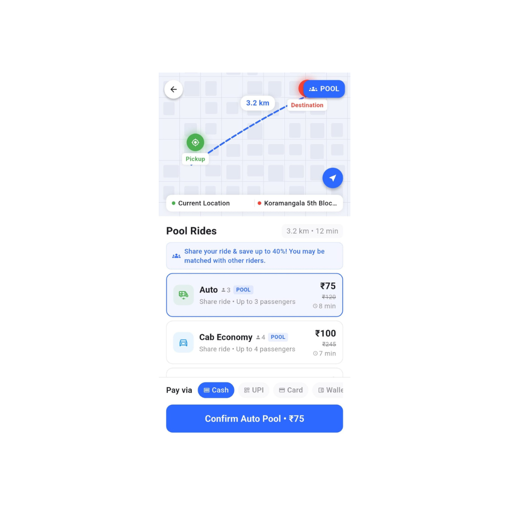
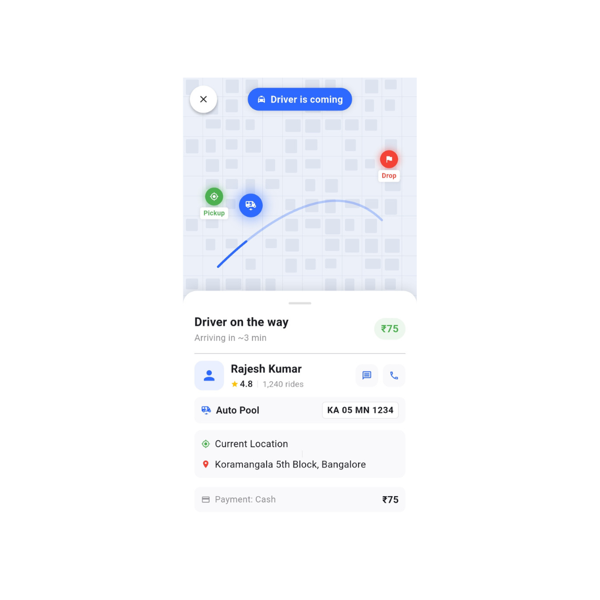
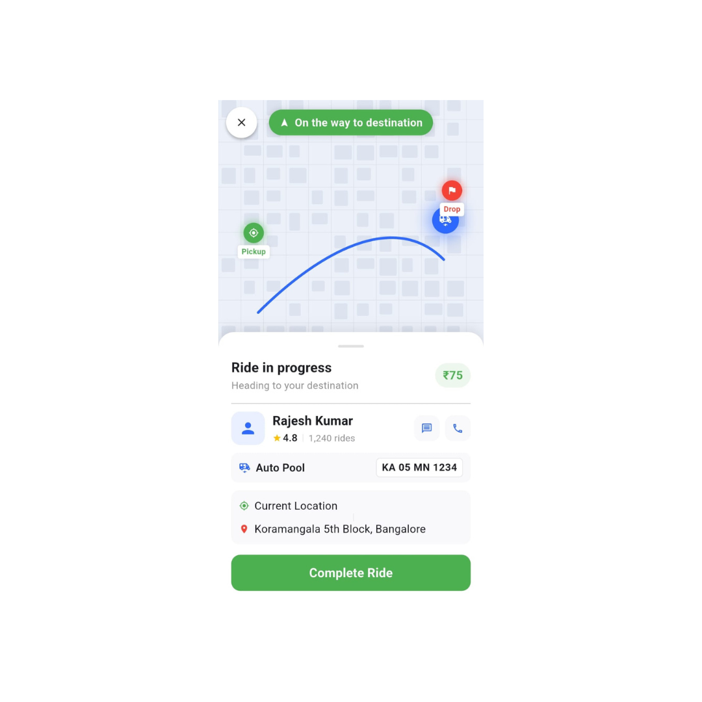
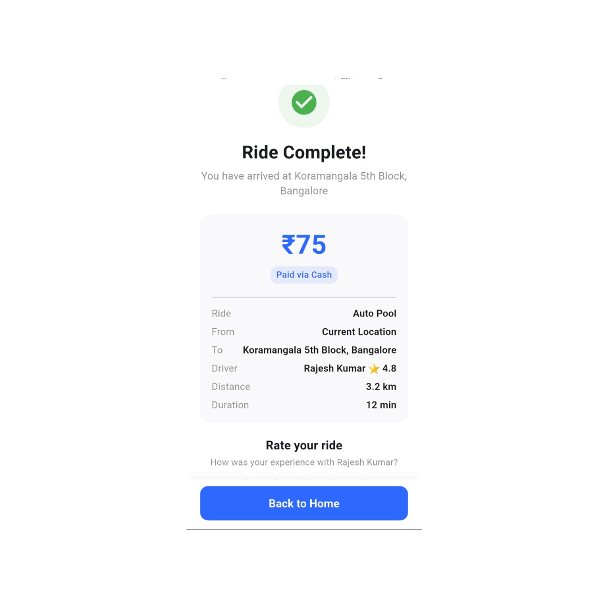
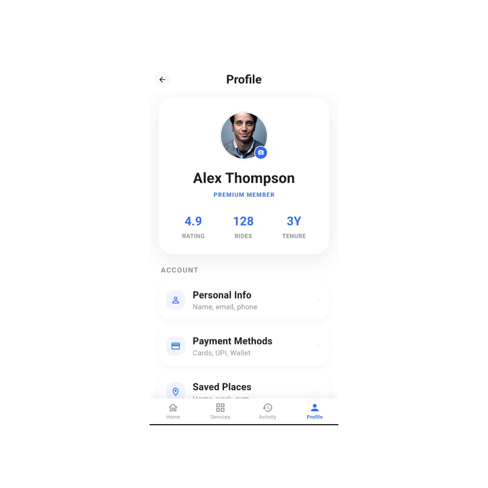

# 🚀 Ride2Go – AI-Assisted Ride Booking App (Flutter UI/UX)

Ride2Go is a Rapido-inspired ride booking application focused on delivering a seamless and modern user experience.

This project showcases a complete ride-booking flow including booking, tracking, and ride completion — built using Flutter.

---

## 💡 About the Project

This project was developed using a **prompt-driven (AI-assisted) development workflow**, focusing on UI/UX design, frontend implementation, and system flow.

The goal was to simulate a real-world ride booking application with a strong focus on usability and design.

---

## 🎯 Key Features

- 🚗 Ride booking interface  
- 📍 Smart ride selection (Auto, Cab, Bike, Parcel)  
- 🗺️ Live ride tracking UI simulation  
- 💰 Fare calculation & trip summary  
- ⭐ Ride completion with rating system  
- 📊 Activity history  
- 👤 User profile section  
- 📦 Parcel delivery feature  

---

## 🧠 My Contribution

- 🎨 Designed complete UI/UX of the application  
- 💻 Developed frontend flow using Flutter  
- 🧩 Structured data architecture and feature logic  
- 🚀 Added multiple services and features  

---

## 🛠️ Tech Stack

- Flutter  
- Dart  
- AI Tools (Prompt-based development)

---

## 📸 Screenshots

---

## ⚠️ Note

This project focuses on **UI/UX and frontend experience**.  
Backend functionality is not implemented.

---

## 🚀 Future Improvements

- Backend integration  
- Real-time ride tracking  
- Payment gateway integration  
- Authentication system  

---

## 🙌 Acknowledgement

Guided by **Dr. Kartik Joshi**

---

## 📌 Project Status

✅ UI/UX Completed  
✅ Frontend Flow Implemented  
❌ Backend Not Implemented